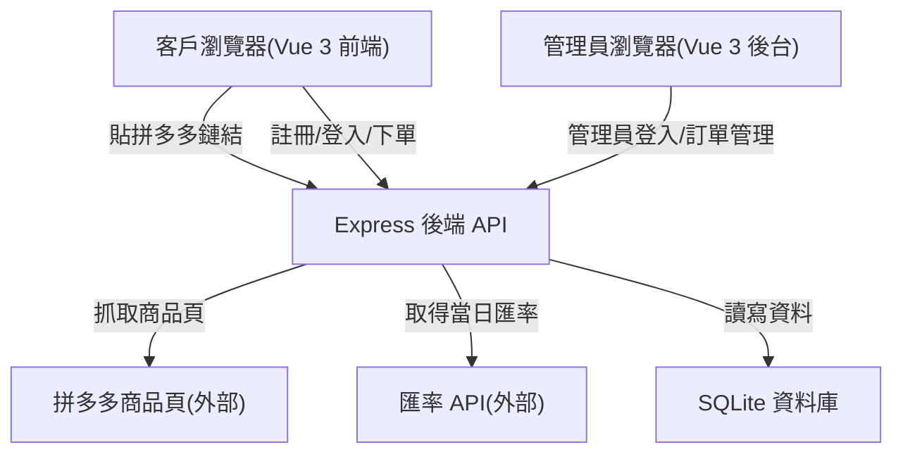
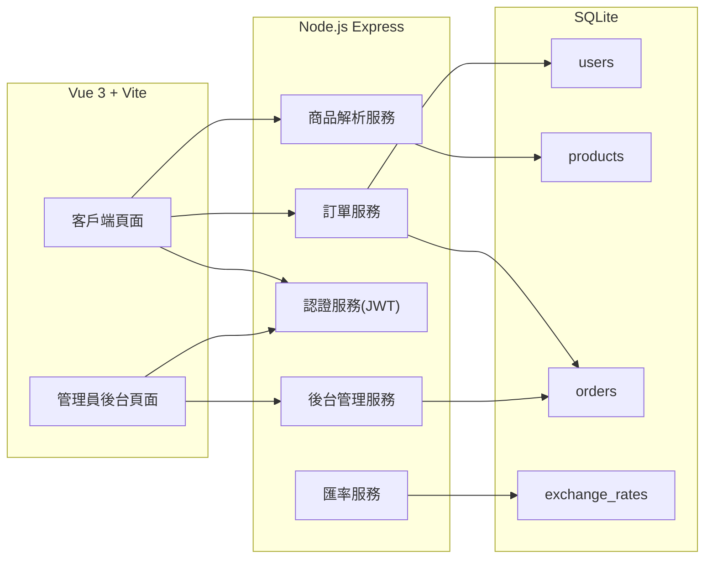

# Pinduoduo Consignment Store 技術設計

Feature Name: 2026-08-14-pdd-consignment-store
Updated: 2026-08-14

## Description

面向香港買家的拼多多代購網站。客戶貼上拼多多商品鏈結，系統自動抓取商品資訊（名稱、價格、規格、圖片、重量），以當日 CNY/HKD 匯率換算並附加 10% 代購服務費計算售價；運費按重量向上取整 × 10 HKD/kg 計算。客戶需註冊（聯絡人、電話、收貨地址）後方可下單，管理員於後台管理訂單與設定。

## Architecture

## Components and Interfaces

### 前端 (Vue 3 + Vite)

- 客戶端頁面：
  - `/` 首頁：貼拼多多鏈結輸入框
  - `/product?url=...` 商品詳情：顯示商品資料與規格選擇
  - `/register` 註冊：填寫帳號、密碼、聯絡人、電話、收貨地址
  - `/login` 登入
  - `/orders` 我的訂單
- 管理員後台：
  - `/admin/login` 管理員登入
  - `/admin/dashboard` 訂單列表、客戶列表、匯率/費率設定
- Vite dev server 配置 `/api` 反向代理至後端 (port 3001)

### 後端 (Express, port 3001)

| 接口 | 方法 | 說明 |
|------|------|------|
| `/api/auth/register` | POST | 客戶註冊 |
| `/api/auth/login` | POST | 客戶登入，返回 JWT |
| `/api/auth/admin-login` | POST | 管理員登入，驗證 gary/123123 |
| `/api/products/fetch` | POST | 提交拼多多鏈結，抓取商品資料 |
| `/api/products/:id` | GET | 取得商品詳情 |
| `/api/orders` | POST | 建立訂單（需客戶 JWT） |
| `/api/orders` | GET | 查詢本人訂單（需客戶 JWT） |
| `/api/admin/orders` | GET | 管理員查詢全部訂單 |
| `/api/admin/orders/:id/status` | PATCH | 更新訂單狀態 |
| `/api/admin/rates` | GET | 查詢匯率與運費費率 |
| `/api/admin/rates` | PUT | 更新運費費率 |

### 商品解析服務 (Pinduoduo Scraper)

1. 從鏈結解析 `goods_id`（支援 `mobile.yangkeduo.com/goods.html?goods_id=xxx` 等格式）
2. 以模擬瀏覽器 User-Agent 請求商品頁
3. 從頁面 HTML 中提取 `window.rawData` 或 JSON 區塊解析：
   - 商品名稱、人民幣價格、圖片
   - 規格選項（SKU：顏色/尺寸/版本等）與對應價格
   - 重量（若頁面提供，否則預設 1kg）
4. 若商品有多個 SKU 且價格不同，以最低價格作為基礎售價
5. 抓取結果緩存至 products 表

### 匯率服務

- 每日首次請求時向免費匯率 API（如 open.er-api.com `CNY` 對 `HKD`）取得當日匯率
- 緩存於 exchange_rates 表，當日重複請求使用緩存
- API 失敗時回退至最近一次成功匯率

### 認證服務

- 客戶密碼以 bcrypt 雜湊存儲
- 登入成功發放 JWT，訂單接口需帶 Authorization header
- 管理員憑證：帳號 gary，密碼 123123（後端驗證，密碼以 bcrypt 存儲）

## Data Models

### users

| 欄位 | 型別 | 說明 |
|------|------|------|
| id | INTEGER PK | |
| username | TEXT UNIQUE | 登入帳號 |
| password_hash | TEXT | bcrypt 雜湊 |
| contact_name | TEXT | 聯絡人姓名 |
| phone | TEXT | 聯絡電話 |
| address | TEXT | 收貨地址 |
| created_at | TEXT | 註冊時間 |

### products

| 欄位 | 型別 | 說明 |
|------|------|------|
| id | INTEGER PK | |
| goods_id | TEXT UNIQUE | 拼多多商品 ID |
| pdd_url | TEXT | 原始鏈結 |
| name | TEXT | 商品名稱 |
| price_cny | REAL | 人民幣價格 |
| images | TEXT JSON | 圖片 URL 陣列 |
| specs | TEXT JSON | 規格選項陣列 [{name, options:[...]}] |
| weight_kg | REAL | 商品重量，預設 1 |
| fetched_at | TEXT | 抓取時間 |

### orders

| 欄位 | 型別 | 說明 |
|------|------|------|
| id | INTEGER PK | |
| user_id | INTEGER FK | 下單客戶 |
| product_id | INTEGER FK | 商品 |
| specs | TEXT JSON | 客戶所選規格 |
| quantity | INTEGER | 數量 |
| unit_price_hkd | REAL | 單價港幣(含服務費) |
| shipping_fee | REAL | 運費 |
| total_hkd | REAL | 總金額 |
| payment_note | TEXT | 客戶填寫之付款備註 |
| status | TEXT | pending / confirmed / shipped / completed |
| created_at | TEXT | 下單時間 |

### 訂單狀態流轉

- 客戶建立訂單後狀態為 `pending`
- 管理員核對客戶付款入帳後更新為 `confirmed`
- 管理員出貨後更新為 `shipped`
- 客戶收貨後管理員更新為 `completed`

### exchange_rates

| 欄位 | 型別 | 說明 |
|------|------|------|
| id | INTEGER PK | |
| currency_from | TEXT | CNY |
| currency_to | TEXT | HKD |
| rate | REAL | 匯率 |
| date | TEXT | 生效日期 |

### admin_settings

| 欄位 | 型別 | 說明 |
|------|------|------|
| id | INTEGER PK | |
| shipping_rate_per_kg | REAL | 運費費率，預設 10 HKD |
| service_fee_pct | REAL | 服務費比例，預設 0.10 |
| updated_at | TEXT | 更新時間 |

## Correctness Properties

- **價格計算**：`unit_price_hkd = round(price_cny × rate × 1.1, 2)`，服務費比例取 admin_settings
- **運費計算**：`shipping_fee = ceil(weight_kg) × shipping_rate_per_kg`
- **總金額**：`total_hkd = unit_price_hkd × quantity + shipping_fee`
- **訂單不可變**：訂單建立時快照售價、匯率與運費，後續費率調整不影響已建立訂單
- **權限隔離**：客戶僅可查詢本人訂單；管理員接口需管理員 JWT
- **註冊完整性**：帳號、密碼、聯絡人、電話、收貨地址均為必填

## Error Handling

| 情境 | 處理 |
|------|------|
| 拼多多鏈結無效或缺少 goods_id | 返回 400 並提示「無法解析商品鏈結」 |
| 拼多多抓取失敗/反爬蟲封鎖 | 返回 502 並提示「暫時無法取得商品資料，請稍後重試」 |
| 匯率 API 失敗 | 回退至最近成功匯率並於前端提示「使用最近匯率」 |
| 註冊帳號重複 | 返回 409 並提示「帳號已被使用」 |
| 登入憑證錯誤 | 返回 401 並提示「帳號或密碼錯誤」 |
| 未登入訪問訂單接口 | 返回 401 提示重新登入 |
| 下單時商品不存在 | 返回 404 |

## Test Strategy

- 單元測試：價格計算與運費計算邏輯（含邊界：不足 1kg、恰為整數、多 SKU）
- API 測試：註冊/登入/管理員登入/建立訂單/查詢訂單流程
- 商品解析測試：以拼多多商品頁樣本驗證資料提取
- 權限測試：客戶無法訪問管理員接口、無法查詢他人訂單

## References

[^1]: (Website) - [拼多多網頁版商品頁格式](https://mobile.yangkeduo.com/)
